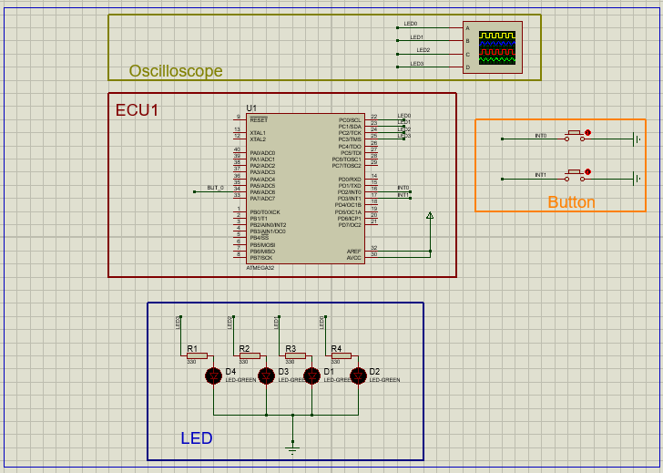

# LED sequence V3 project  Based On MISRA Rules  

## Author
### **Bassel Yasser Mahmoud**

---
## My work

**`Code Implementation...........`** 👉🏻 [HERE](./Code/)

**`Video.........................`** 👉🏻 [HERE](./Video/)

## MISRA Rules applied on this project

> **Rule 1.1:** _A compiler warning shall be produced for any instance of code that does not conform to the rules of the Standard._

> **Rule 2.1:** _Assembly language shall be encapsulated and isolated._

> **Rule 5.2:** _Expressions shall not be used as the controlling expression of an if statement or as the operand of a while or do-while statement._

> **Rule 10.3:** _The value of a complex expression of integer type shall only be cast to a type that is narrower and of the same signedness as the underlying type of the expression._

> **Rule 12.1:** _Only one break statement shall appear in the body of a switch statement._

> **Rule 13.5:** _The operands of the && and || operators shall be of scalar type._

> **Rule 14.2:** _All non-static functions shall have external linkage._

> **Rule 14.3:** _A function shall not have multiple exit points.

> **Rule 17.3:** Type definitions shall not be used in the return types of functions._

> **Rule 18.4:** _Unions shall not be used._

---

## Schematic

